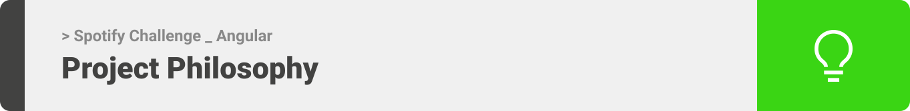
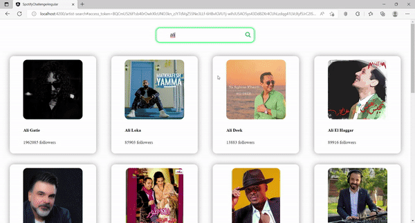

<div align="center">

> Hello world! This is the project’s summary that describes the project plain and simple, limited to the space available. 
 


**[PROJECT PHILOSOPHY](#-project-philosophy) • [WIREFRAMES](#-wireframes) • [TECH STACK](#-tech-stack) • [IMPLEMENTATION](#-impplementation) • [HOW TO RUN?](#-how-to-run)**
</div>

<br>




> Using the [Spotify API](https://developer.spotify.com/documentation/web-api/), this application provides searching for an artist to 
retrieve information about his/her albums.


### User Stories
- As a user, I want to login with spotify using [Spotify Implicit Grant](https://developer.spotify.com/documentation/general/guides/authorization/implicit-grant/) authentication flow.
- As a user, I want to search for any artist.
- As a user, I want to browse artists matching with my search.
- As a user, I want to browse an artist albums.

<br>


> This design was given to make a clone to it.
Note that i didn't use any styling library or theme, all from scratch and using pure css modules.
<br>
(Please note that pictures make take few seconds to open due to high quality)

### App Wireframes 💻

| Login  | Search for an Artist
| -----------------| -----|
|  |  |

| Search's Results  | Viewing the Artist's Albums
| -----------------| -----|
|  |  |

<br>


Here's a brief high-level overview of the tech stack the app uses:

- This project uses the [Angular framework](https://angular.io/guide/what-is-angular). Angular is a development platform, built on Typescript. As a platform, Angular includes: A component-based framework for building scalable web applications / A collection of well-integrated libraries that cover a wide variety of features, including routing, forms management, client-server communication, and more / A suite of developer tools to help you develop, build, test, and update your code.
- The authorization and fetching required data was provided by the [Spotify API](https://developer.spotify.com/documentation/web-api/) services.

<br>


> Using the above mentioned tech stacks and the wireframes, the implementation of the app is shown as below, these are screenshots from the real app.
<br>
(Please note that the following are gifs and may take few seconds to open)

### App Implementation 💻

| Login
| -----------------|
|  |

| Search's Results  |
| -----------------|
|  |

| Viewing the Artist's Albums
| -----------------|
|  |

<br>


> This is an example of how you may give instructions on setting up your project locally.
To get a local copy up and running follow these simple example steps.

### Prerequisites

This is an example of how to list things you need to use the software and how to install them.
* npm
  ```sh
  npm install npm@latest -g
  ```

### Installation

_Below is an example of how you can instruct your audience on installing and setting up your app. This template doesn't rely on any external dependencies or services._

1. Clone the repo
   ```sh
   git clone https://github.com/Hadi-AlKammouni/Spotify_Challenge_Angular.git
   ```
2. Install NPM packages
   ```sh
   npm install
   ```
3. To run a folder
   ```
   ng serve
   ```
